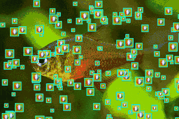

Canvas Draw Balls
=================

Тестовое приложение, которое рисует что-нибудь на канвасе.
Я просто хотел освоить рисование на веб-страницах.
После изучения темы выбрал рисование в теге canvas.
Оказалось, что это очень просто.
В первый день я написал простой контроллер, который следит за комнатой и выполняет отрисовку.

Changelog
---------

### 0.0.0 от 2017-06-29
Первая рабочая версия. Написал просто контроллер RoomController. Он подписывается на отрисовку с помощью метода `requestAnimationFrame`. Этот метод вызывает сам браузер когда будет готов выполнить перерисовку страницы.
При отрисовке 10К мячей я получаю стабильно 60 fps.

Статистика

 Мячей  | FPS
--------|-------
 200    | 60.0
 1000   | 54.4
 5000   | 11.2
 25000  | 1.5 

Превью (по клику откроется оригинал)

